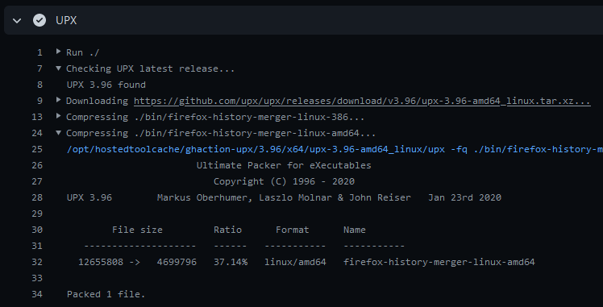

[](https://github.com/crazy-max/ghaction-upx/releases/latest)
[](https://github.com/marketplace/actions/upx-github-action)
[](https://github.com/crazy-max/ghaction-upx/actions?workflow=test)
[](https://codecov.io/gh/crazy-max/ghaction-upx)
[](https://github.com/sponsors/crazy-max)
[](https://www.paypal.me/crazyws)

## About

GitHub Action for [UPX](https://github.com/upx/upx), the Ultimate Packer for eXecutables.



___

* [Usage](#usage)
* [Customizing](#customizing)
  * [inputs](#inputs)
* [Limitation](#limitation)
* [Contributing](#contributing)
* [License](#license)

## Usage

```yaml
name: upx

on:
  push:

jobs:
  upx:
    runs-on: ubuntu-latest
    steps:
      -
        name: Checkout
        uses: actions/checkout@v4
      -
        name: Run UPX
        uses: crazy-max/ghaction-upx@v3
        with:
          version: latest
          files: |
            ./bin/*.exe
          args: -fq
```

If you just want to install UPX:

```yaml
name: upx

on:
  push:

jobs:
  upx:
    runs-on: ubuntu-latest
    steps:
      -
        name: Checkout
        uses: actions/checkout@v4
      -
        name: Install UPX
        uses: crazy-max/ghaction-upx@v3
        with:
          install-only: true
      -
        name: UPX version
        run: upx --version
```

## Customizing

### inputs

The following inputs can be used as `step.with` keys

| Name           | Type   | Default  | Description                                                |
|----------------|--------|----------|------------------------------------------------------------|
| `version`      | String | `latest` | UPX version. Example: `v3.95`                              |
| `files`        | String |          | Newline-delimited list of path globs for files to compress |
| `args`         | String |          | Arguments to pass to UPX                                   |
| `install-only` | String | `false`  | Just install UPX                                           |

## Limitation

This action is only available for Linux and Windows [virtual environments](https://help.github.com/en/articles/virtual-environments-for-github-actions#supported-virtual-environments-and-hardware-resources).

## Contributing

Want to contribute? Awesome! The most basic way to show your support is to star
the project, or to raise issues. You can also support this project by [**becoming a sponsor on GitHub**](https://github.com/sponsors/crazy-max)
or by making a [PayPal donation](https://www.paypal.me/crazyws) to ensure this
journey continues indefinitely!

Thanks again for your support, it is much appreciated! :pray:

## License

MIT. See `LICENSE` for more details.
